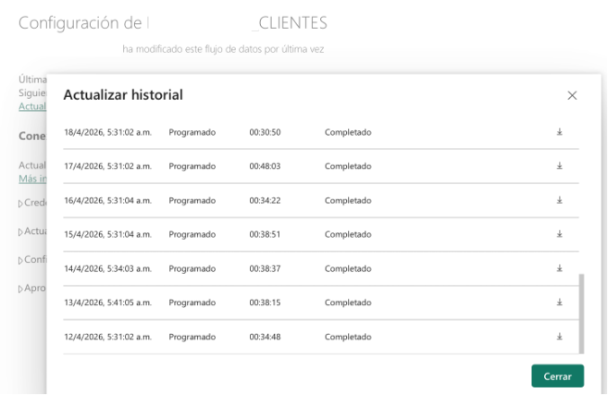
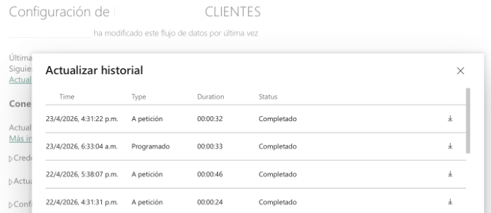
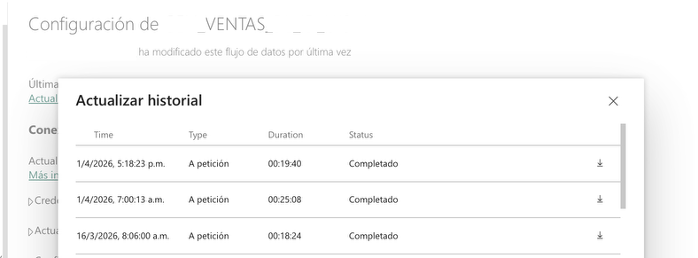
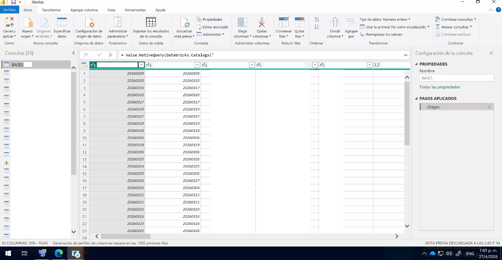
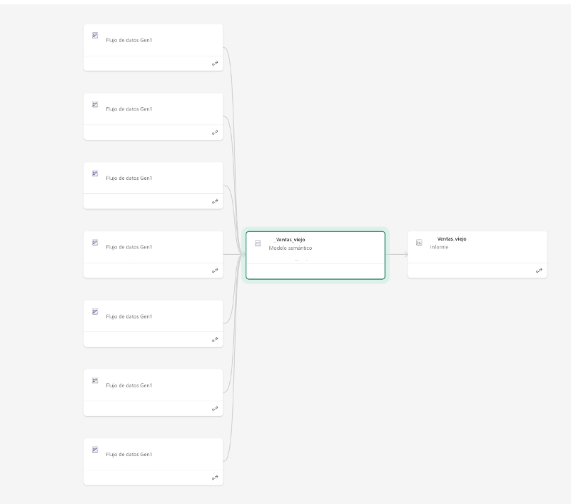
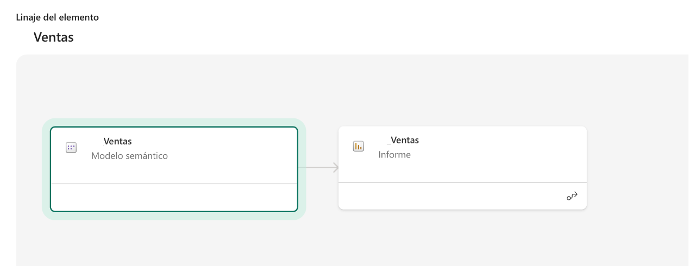
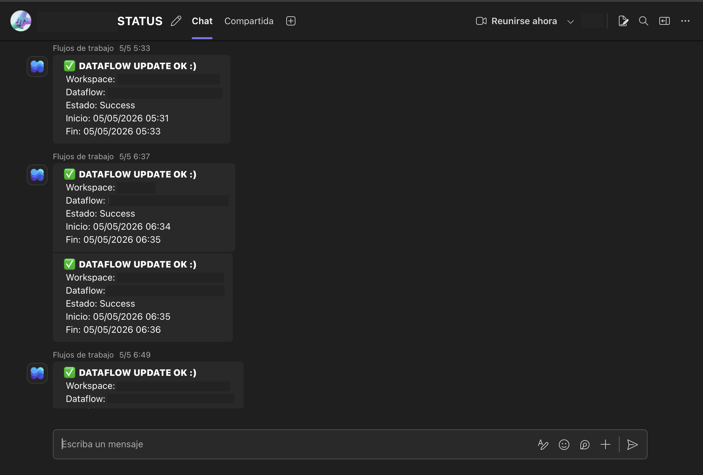

# Power Query → SQL: Migrating Dataflows and Dashboards to Databricks

> How moving transformation logic from Power Query to SQL in Databricks reduced refresh times by 70%–97%, eliminated cancellations, and simplified the data architecture of the sales ecosystem.

---

## Context

In Power BI environments with heavy transformation workloads, Power Query (M language) ends up doing work it was never optimized for: type casting, complex joins, calculated columns, and filters over millions of rows. When dataflows are also chained together and dashboards depend on multiple dataflows as input, the result is a fragile architecture — slow, hard to maintain, and prone to cascading cancellations.

The solution was to move all transformation logic to the right engine — Databricks — and connect dashboards directly to lakehouse tables, without going through intermediate dataflows.

> **These are some examples of the work done. The full migration covered more than 10 dataflows and several dashboards in the sales area.**

---

## Results

| Component | Type | Before | After | Improvement |
|---|---|---|---|---|
| DF_CLIENTES | Dataflow | ~40 min | < 1 min | ↓ 97% |
| DF_VENTAS | Dataflow | >1h + cancellations | ~20 min stable | ↓ 70% |
| VENTAS | Dashboard | ~60 min, 7 inputs | ~10 min, 1 connection | ↓ 83% |

Beyond timing, the impact was architectural:

- Simplified lineages — from 7 dataflow inputs to a direct Databricks connection
- Elimination of chained dependencies between flows
- Zero cancellations since the migration
- Semantic models with 1 single Power Query step instead of 20+
- Automatic monitoring of critical processes via Power Automate + Teams

---

## Why Move Logic to SQL in Databricks

### In dataflows

Power Query runs transformations on Power BI capacity. When there are many applied steps — type casts, joins, calculated columns, null replacements — Power BI loads and processes data in its own engine, consuming workspace capacity and generating high refresh times.

By moving that logic to SQL executed in Databricks via `Value.NativeQuery`, the processing happens in Databricks' analytical engine, which is designed and optimized for exactly that. Power BI receives already-transformed data and only needs one step: the source.

**Concrete advantages:**
- Databricks scales horizontally for large volumes — Power BI does not
- SQL runs in Databricks SQL Warehouse, without consuming Power BI workspace capacity
- Fewer Power Query steps = lower maintenance complexity
- Transformations live in SQL, more readable and auditable than chained M steps
- `Value.NativeQuery` enables full query folding: the transformation executes at the source
- Eliminates the need to create intermediate views or tables just to expose data to Power BI

### In dashboards

When a semantic model depends on multiple dataflows as input, each refresh requires all those dataflows to finish first. If one fails, the model becomes stale. Additionally, each layer of the chain consumes Power BI capacity running its own transformations.

By connecting the semantic model directly to lakehouse tables in Databricks, that chain is eliminated. The model reads directly from the source of truth.

**Concrete advantages:**
- No dependencies between dataflows — the model refreshes as soon as Databricks tables are available
- A failure in an upstream process does not cancel the dashboard
- Simplified lineage: easy to understand, audit, and maintain
- Shorter refresh times because there are no intermediate processing layers
- Cleaner architecture: Databricks as the processing layer, Power BI as the consumption layer

---

## Core Principle

```
Power BI consumes. Databricks processes.
```

Each engine doing what it does best.

---

## Case 1 — DF_CLIENTES (Dataflow)

**Before:** scheduled executions between 30 and 48 minutes, with 20+ applied steps in Power Query.  
**After:** updates completed in seconds, with a single step — `Value.NativeQuery` against Databricks.

### Refresh History

**Before (~30–48 min per execution):**



**After (seconds):**



### Power Query to SQL Translation

**Before — multiple M steps:**
```m
let
    source = ...,
    changed_types = Table.TransformColumnTypes(
        source,
        {{"id_cliente", Int64.Type}, {"nombre", type text}}
    ),
    filtered_rows = Table.SelectRows(
        changed_types,
        each [activo] = true
    ),
    replaced_nulls = Table.ReplaceValue(
        filtered_rows, null, "N/A",
        Replacer.ReplaceValue, {"region"}
    )
    // ... 15+ more steps
in
    replaced_nulls
```

**After — 1 step, SQL in Databricks:**
```m
let
    source = Databricks.Catalogs(
        "adb-xxx.azuredatabricks.net",
        "/sql/1.0/warehouses/xxx"
    ),
    result = Value.NativeQuery(
        source,
        "
        SELECT
            CAST(id_cliente AS INT),
            nombre,
            COALESCE(region, 'N/A') AS region,
            activo
        FROM catalog.schema.dim_clientes
        WHERE activo = 1
        "
    )
in
    result
```

---

## Case 2 — DF_VENTAS (Dataflow)

**Before:** history with frequent cancellations, erroneous executions, and runtimes over 1 hour. The flow depended on 3 upstream dataflows — if any one failed, this one was cancelled in cascade.  
**After:** stable executions of 18–25 minutes, with no external dependencies.

### Refresh History

**Before — cancellations and errors:**


**After — stable execution:**



### Before — chained dependencies
```
DF_VENTAS_ACTUAL  ──┐
DF_VENTAS_HIST   ───┼──► DF_VENTAS  ← if any fails, this gets cancelled
DF_VENTAS_ID     ──┘
```

### After — independent flow with direct SQL
```sql
SELECT
    v.id,
    v.fecha_venta,
    v.cantidad,
    v.precio_unitario,
    v.cantidad * v.precio_unitario AS total_venta
FROM fact_ventas v
WHERE v.anio_mes >= 202401
```

---

## Case 3 — VENTAS (Dashboard)

This is the most complete case: it combines Power Query refactoring with the elimination of dataflow dependencies in the semantic model.

**Before:** the model depended on 7 dataflows as input (including SharePoint sources), had 72 queries in Power Query with multiple applied steps per table, and took ~60 minutes to refresh.  
**After:** direct connection to Databricks via `Value.NativeQuery`, 33 queries, 1 single step per table, refresh in ~10 minutes.

### Power Query — Before and After

**Before — 72 queries, 20+ steps per table:**


**After — 33 queries, 1 step (Source):**



### Lineage — Before and After

**Before — 7 dataflow inputs:**



**After — direct connection to Databricks:**



### What Changed in Power Query

**Before — dozens of steps per table:**
```m
// BASES — applied steps (excerpt):
// Step 1
// Step 2
// Step 3
// Step 4
// Step 5
// Step 6
// Step 7
// Step 8
// Step 9
// Step 10
// Step 11
// Step 12
// ... and several more steps

= Table.TransformColumnTypes(
    #"Previous Step",
    {{"column", Int64.Type}}
)
// Each table in the model had its own chain of steps.
// In total: 72 queries, each with its own transformation stack.
```

**After — 1 step per table:**
```m
// BASES — applied steps:
// Source  ← single step

= Value.NativeQuery(
    Databricks.Catalogs(
        "adb-xxx.azuredatabricks.net",
        "/sql/1.0/warehouses/"
    ),
    "
    SQL query here...
    "
)
// All logic lives in SQL inside Databricks.
// Power Query just connects and retrieves the result.
```

---

## Most Common M → SQL Translations

### Type casting
```m
-- Power Query (M):
Table.TransformColumnTypes(table, {{"price", type number}})
```
```sql
-- Databricks SQL:
CAST(price AS DECIMAL(10,2))
-- or Databricks dialect:
price::DECIMAL(10,2)
```

### Row filtering
```m
-- Power Query (M):
Table.SelectRows(table, each [status] = "Active")
```
```sql
-- Databricks SQL:
WHERE status = 'Active'
```

### Calculated column
```m
-- Power Query (M):
Table.AddColumn(table, "total", each [quantity] * [price])
```
```sql
-- Databricks SQL:
SELECT *, quantity * price AS total FROM table
```

### Replace nulls
```m
-- Power Query (M):
Table.ReplaceValue(table, null, "N/A", Replacer.ReplaceValue, {"region"})
```
```sql
-- Databricks SQL:
COALESCE(region, 'N/A') AS region
```

### Table join
```m
-- Power Query (M):
Table.NestedJoin(sales, {"id"}, clients, {"id"}, "tmp", JoinKind.Left)
-- + Table.ExpandTableColumn(...)
```
```sql
-- Databricks SQL:
SELECT v.*, c.client_name
FROM fact_sales v
LEFT JOIN dim_clients c ON v.client_id = c.id
```

---

## Monitoring: Automated Alerts with Power Automate and Teams

A Power Automate flow was implemented that triggers when a dataflow or semantic model refresh completes, evaluates the execution status, and sends a message to the Teams channel with the workspace, component name, status, start time, and end time.

This eliminated the need to manually check the refresh history of each component.

```
✅ DATAFLOW UPDATE OK :)
Workspace: PRODUCTION
Dataflow:  DF_VENTAS
Status:    Success
Start:     27/04/2026 07:03
End:       27/04/2026 07:25
```

---



## Stack

- **Power BI Service** — consumption, semantic modeling and visualization
- **Databricks (Azure)** — SQL transformations, analytical storage (lakehouse)
- **Power Query M** — reduced to connection + `Value.NativeQuery`
- **Power Automate** — automated alerts in Microsoft Teams
- **Git / YAML / Airflow** — version control and ingestion pipeline orchestration

---

## Key Takeaways

**1. Don't translate line by line.** M and SQL think differently. M is sequential; SQL is declarative over sets. Rethink the logic completely, don't just copy steps.

**2. `Value.NativeQuery` is the bridge.** It allows running arbitrary SQL against Databricks from Power Query. The result arrives already processed — Power BI does no additional transformation.

**3. Start with the slowest ones.** The impact is immediate and justifies the effort to stakeholders.

**4. Document the lineage before migrating.** Understanding what each flow depends on prevents breaking things in cascade.

**5. The benefit isn't just speed.** Maintenance simplicity, fewer failure points, and greater operational stability are equally valuable.

**6. Connecting dashboards directly to Databricks breaks the dependency chain.** When the semantic model reads directly from the lakehouse, a failure in an upstream dataflow doesn't affect it. Each component is independent.

---

## Author

**Ing. Mathias Ortiz**  
[LinkedIn](https://www.linkedin.com/in/mathiasortiz) · [GitHub](https://github.com/MathiasOrtiz)

---

*Component names were modified to avoid exposing internal information. This README documents a real migration carried out in April 2026.*
